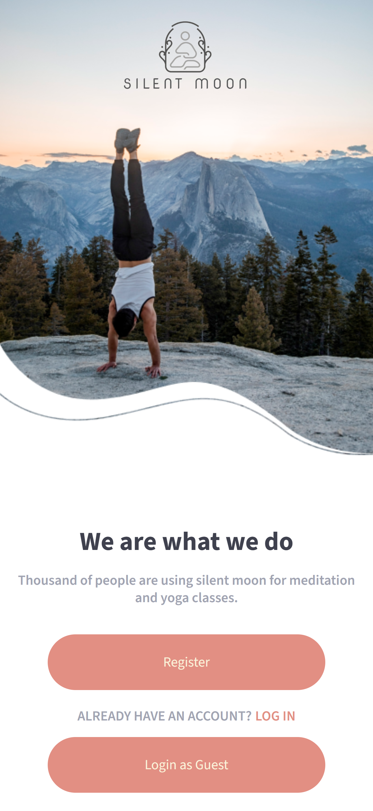
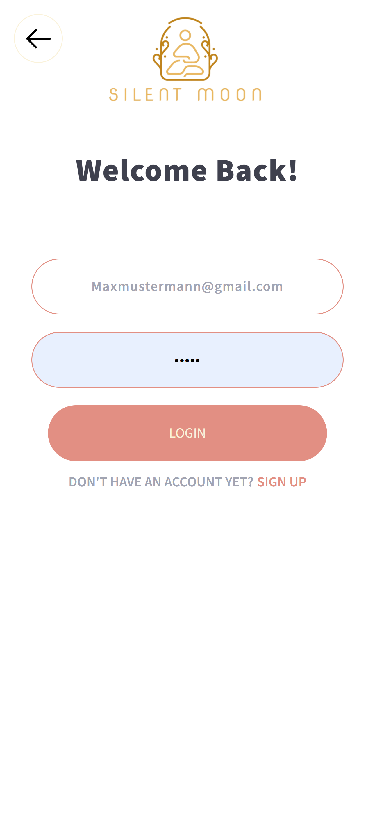
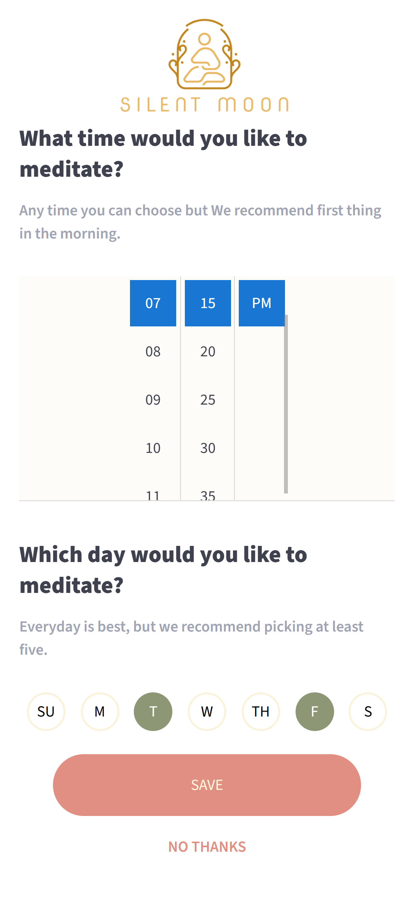
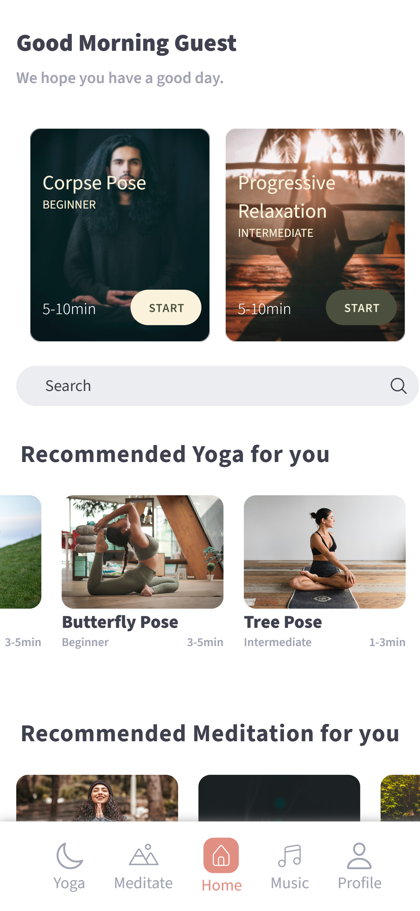
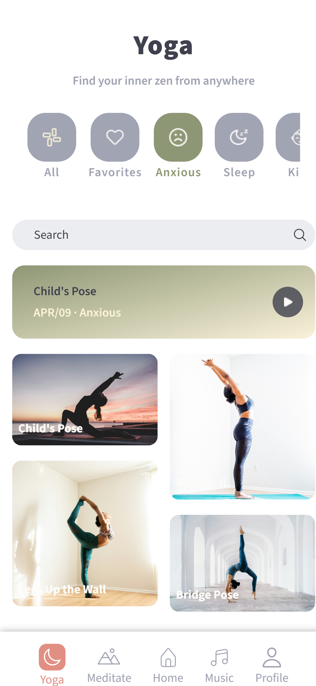
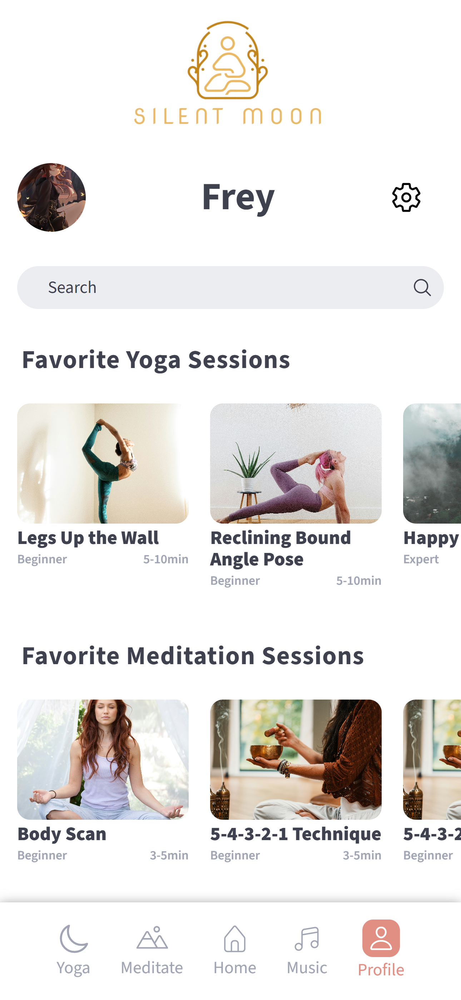
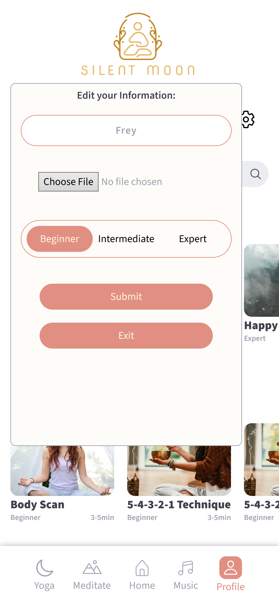

<h1 align="center"><samp>Silent Moon</samp> </h1>

 
  
  
  

<h3><samp>Contributors:</samp></h3>
<ul>
<a href="https://github.com/xoFrey"><li><samp>Izel Acar</samp></li></a>
<a href="https://github.com/StefanHolz1997"><li><samp>Stefan Holz</samp></li></a>
<a href="https://github.com/ChrissQAng"><li><samp>Christian</samp></li></a>

</ul>

<h3><samp>Build with:</samp></h3>
<ul>
<li><samp>ReactJS Vite</samp></li>
<li><samp>JavaScript</samp></li>
<li><samp>HTML5</samp></li>
<li><samp>Tailwind CSS</samp></li>
<li><samp>Node JS</samp></li>
<li><samp>Mongoose</samp></li>  
<li><samp>Spotify API</samp></li>
</ul>

<samp>
  <h2>App Features</h2>
  <ul>
    <li>
      <strong>User Registration & Login</strong>
      <ul>
        <li>Create an account with personalized settings.</li>
        <li>Stay logged in or log in as a guest user.</li>
        <li>Verify your registration via Email.</li>
      </ul>
    </li>
    <li>
      <strong>User Profile Management</strong>
      <ul>
        <li>Specify skill level during registration.</li>
        <li>Customize profile with profile picture and username.</li>
        <li>Add, view, and remove favorite exercises.</li>
      </ul>
    </li>
    <li>
      <strong>Exercise Filtering & Search</strong>
      <ul>
        <li>Filter exercises by level, category (Yoga, Meditation), and more.</li>
        <li>Search exercises by name for quick access.</li>
      </ul>
    </li>
    <li>
      <strong>Curated Content</strong>
      <ul>
        <li>Personalized exercise recommendations based on user level.</li>
      </ul>
    </li>
    <li>
      <strong>Exercise Interaction</strong>
      <ul>
        <li>Download exercises for offline use.</li>
        <li>Add exercises to a favorites list for easy access.</li>
      </ul>
    </li>
    <li>
      <strong>Notifications & Reminders</strong>
      <ul>
        <li>Schedule and manage notifications for exercises.</li>
        <li>Update notification settings in profile.</li>
      </ul>
    </li>
  </ul>
</samp>

<h2><samp>Live site</samp></h2>

<samp>Once visiting the Live Page please ensure to put on Mobile Mode: Right Click, Inspect, CTRL+SHIFT+M to enable device toolbar</samp> 

<samp>This WebAPP is only for Mobile devices.</samp> 

<li><samp><a href="https://silentmoon.superprojekte.de">Live Page</a></samp></li>

<h2><samp>Screenshot</samp></h2>

 

 

 

 

 

   

